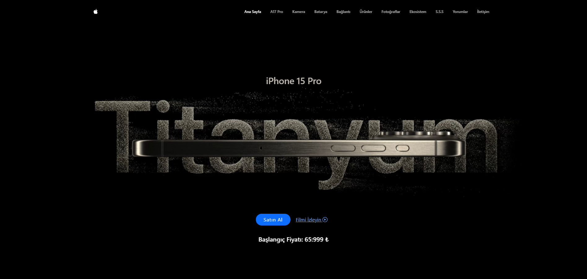
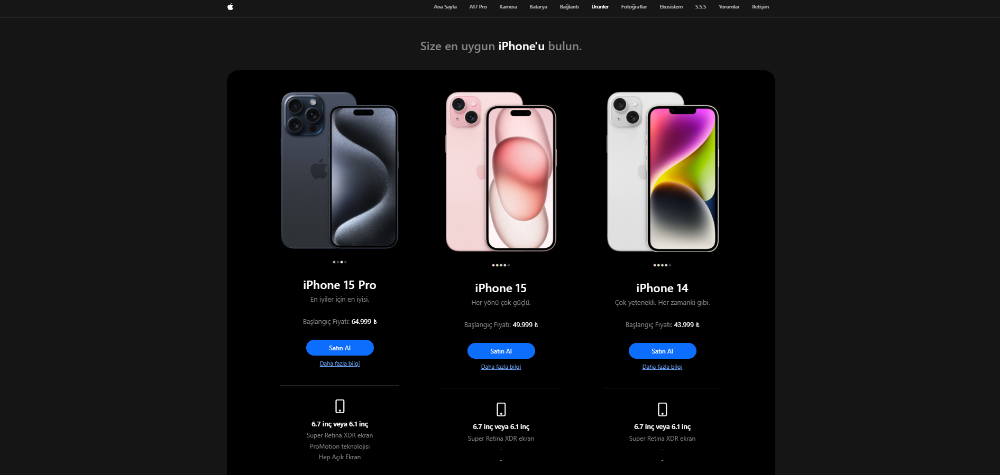
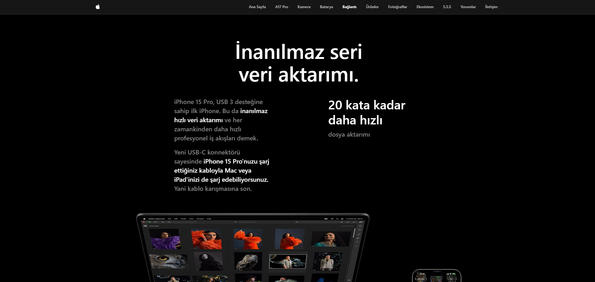
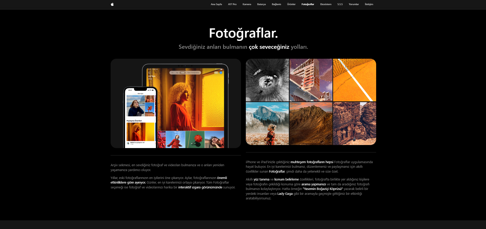

# Patika+ Frontend Bootcamp Hafta-07 (Apple - iPhone 15 Pro Website Clone)

Bu proje, Apple'ın iPhone 15 Pro web sitesinin klonudur. HTML, CSS ve JavaScript kullanılarak geliştirilmiştir. Tasarımda **Bootstrap**, **Swiper** ve **Glightbox** kütüphaneleri kullanılmıştır.

## Kullanılan Teknolojiler
- **HTML, CSS, JavaScript**
- **Bootstrap** – Responsive tasarım için
- **Swiper** – Slider efektleri için
- **Glightbox** – Görseller için lightbox efekti

## Kurulum
1. Projeyi klonlayın:
   ```sh
   git clone https://github.com/emreykaya/w07-apple-clone.git
   ```
2. Klasöre girin:
   ```sh
   cd w07-apple-clone
   ```
3. Tarayıcıda `index.html` dosyasını açarak projeyi görüntüleyin.

## Ekran Görüntüleri





